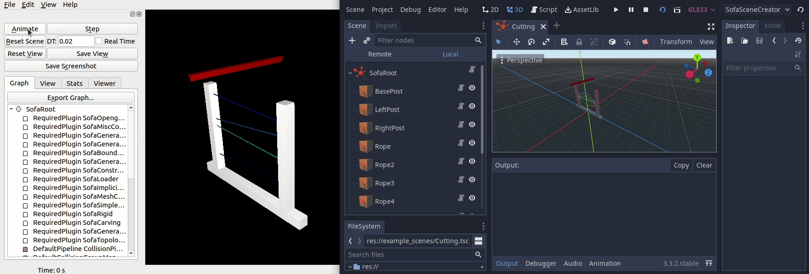
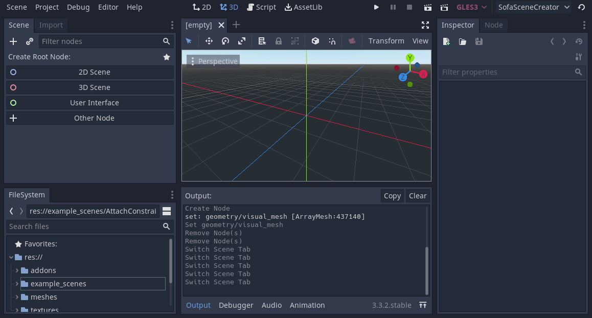

# Sofa Godot
Sofa Godot is a tool to create Sofa Scenes (XML for now) in Godot.


## Installation
This instruction is written for [Canonical Ubuntu 20.04](https://releases.ubuntu.com/20.04/) on x86-64. This Plugin will probably **not** work in other environments.

# Godot
1. Install Godot
   * You can download the Godot game engine [here](https://godotengine.org/download/linux). This plugin was created using **Godot 3.3.2**.
# Additional (you can skip this)
There are other requirements needed to run the plugin. These will automatically be installed if they are not already present once a scene is started.
1. (Optional) Install Sofa
   * You can download the SOFA simulation framework [here](https://www.sofa-framework.org/download/). You can also build your own version if wanted or required.

1. (Optional) Install required packages
   * ``` sudo apt install gmsh openctm-tools ```
      * gmsh is required to convert objects to tetrahedronal objects (for FEM)
      * openctm-tools contains a tool called *ctmconv* which is used to convert between *.obj* and *.stl* files (as needed by Godot and Gmsh respectively)
     
## Getting started
### Working with the plugin
* You can use this example project and create a new scene

OR

* You can copy the plugin folder (addons/sofa_scene_creator) into your Godot project and [enable](https://docs.godotengine.org/en/stable/tutorials/plugins/editor/installing_plugins.html) the plugin like any other Godot plugin.

### Using the example scenes
It is recommended to look at the example scenes (example_scenes/) before creating your own scenes. When you try to run the first example scene, all additional requirements will be installed if you did not already install them manually.

### Creating a new scene
You need to set the paths for each new scene you create in the root node.

* Note: The animated example below still required the manual selection of additional binaries. This is not needed anymore.

If you want to create a new scene, you have to create a SofaRoot object as the scene root, setup the paths:


### Running a scene
To finally run the scene, press F6 or the Play Scene button at the top right. A new instance of SOFA should automatically open if the binary path is set correctly.
All files that are needed to run the scene will automatically be generated and placed either in the project folder or the system temporary (/tmp/) folder.

## Main components explained
### SofaRoot
The SofaRoot component has to always be the root object in the scene. The root node does all the work generating and constructing all that is needed to run a sofa scene. The SofaRoot node also has properties to control some aspects of the SOFA scene and tools to help debugging.
* Gravity: Allows you to set the global gravity
* Collision Distance: The distance between objects at which a collision will be detected
* Time Step: The SOFA time step
* Print [a-zA-Z] functions (will print output of gmsh or SOFA or the XML output)

### SofaObject
The SofaObject component is the most important component for the creation of any object that you will see or interact with. It represents physical objects (soft and rigid bodies) in the scene. The properties will change depending on if you ticked the *Soft Body* property.

### Everything else
Almost all other components will simply interact with SofaObjects as targets, and contain some properties. Look at the example scenes (either of this plugin or of the SOFA examples) to get an idea of their usage.

## Important notices
* At the current time, only XML output is supported.
* The order of objects matters, add the constraints (or anything with a reference to an object) after the SofaObjects. You can re-order using the scene tree visualiser on the left in Godot.
* Currently, the SOFA required plugins (for example "SofaSimpleFem") are not created as needed. Instead, a fixed selection of plugins are used.
* Sometimes errors in red will be printed at the bottom when creating constraints with multiple targets, these can be ignored.
* The plugin understands object hierarchies, but you should not use them at the moment (simply place all objects as a child of the SofaRoot node)

## How do add more features or components
### Creating a new component
```diff
- WARNING
All SOFA component scripts must start with the name sofa
(for example: sofa_fixed_constraint.gd, sofa_sphere_roi.gd).

All SOFA ROIs must end with roi
(sofa_aa_box_roi.gd, sofa_sphere_roi.gd).
```
The standard structure of an additional component is as following:
``` python
tool
# Doesn't have to be spatial, you can choose whatever fits best
extends Spatial 

# Preload (works like import in Python) the XML Tree compoments.
# Each object constructs its own XML tree, but is also able to attach
# requirements to other objects.
const XMLSceneTree = preload("res://addons/sofa_scene_creator/xml_scene_tree.gd")

# SofaUtility contains many useful tools to make the creation of components easier
const SofaUtility = preload("res://addons/sofa_scene_creator/sofa_utility.gd")

# Once the object is loaded, this function is called. You can use this to 
# setup variables, look for certain objects in the scene or create visualisation
# meshes (see addons/sofa_scene_creator/sofa_sphere_roi.gd as an example).
func _enter_tree():
  pass

# This function is called on each object. It should return an XML tree containing
# all the components that SOFA should create for this object. Notice, that 
# this function can also return null (useful if you are only creating requirements
# on other objects, see addons/sofa_scene_creator/sofa_box_constraint.gd as an example).
func get_xml_tree():
  var xml_tree = XMLSceneTree.new()
  # Do stuff with xml_tree
  return xml_tree

# Add in-editor constraints (for example, constrain the movement or rotation in the editor)
func _process(delta):
  # Prevent scaling: 
  #scale = Vector3(0,0,0)

  # Prevent translation:
  #translation = Vector3(0,0,0)

  # Prevent rotation:
  #rotation = Vector3(0,0,0)

  # Prevent translation in x axis:
  #translation = Vector3(0,translation.y,translation.z)
  pass
```
### Adding the component to the plugin
Once a new component is created, the plugin has to be informed to load the component. This is done in the *addons/sofa_scene_creator/plugin.gd*. You need to add two lines for each new component (```add_custom_type(...)``` and ```remove_custom_type(...)```). As a guide, simply see how already existing components are added.


### Useful components
#### Visualization utility functions
``` python
# Draw a line between two positions (Node will usually always be self)
SofaUtility.draw_line(Node, Vector3, Vector3, Color)

# Example: drawing a line between 'this' object and another object
SofaUtility.draw_line(self, translation, other_object.translation, SofaUtility.COLOR_TARGET_OBJECT)
```
``` python
# Draw a cross at a position
SofaUtility.draw_cross(Node, Vector3, Color)

# Example: Draws a purple/pink cross at 'some_position'
SofaUtility.draw_cross(self, some_position, Color(1.0, 0.0, 1.0, 0.5))
```
As you may have noticed, you have to pass a self reference to the utility function. This is because Godot needs to know in what
scene instance the visualisation object needs to instantiated. There should be a way to do this without... But no clean 
way has been found as of yet.

Here are some already, as of writing, defined colors (you can also use your own if wanted):
``` python
const COLOR_TARGET_OBJECT : Color = Color(0.5, 0.5, 0.0, 0.3)
const COLOR_TARGET_ROI : Color =    Color(1.0, 0.0, 0.0, 0.3)
const COLOR_YELLOW : Color =        Color(1.0, 1.0, 0.0, 0.5)
const COLOR_PURPLE : Color =        Color(1.0, 0.0, 1.0, 0.5)
const COLOR_TURQUOISE : Color =     Color(0.0, 1.0, 1.0, 0.5)
const COLOR_BLACK : Color =         Color(0.0, 0.0, 0.0, 0.5)
const COLOR_WHITE : Color =         Color(1.0, 1.0, 1.0, 0.5)
const COLOR_RED : Color =           Color(1.0, 0.0, 0.0, 0.5)
const COLOR_GREEN : Color =         Color(0.0, 1.0, 0.0, 0.5)
const COLOR_BLUE : Color =          Color(0.0, 0.0, 1.0, 0.5)
```

#### Constraining objects and sanity checks
Functions to check if objects are valid with respect to some requirements (verbose flag will print reason on failure):
``` python
# Returns true if 'obj' is a valid sofa component and visible
SofaUtility.is_sofa_node(obj : Node, verbose : bool = false) -> bool

# Returns true if 'obj' is a valid ROI
SofaUtility.is_valid_sofa_ROI(obj : Node, verbose : bool = false) -> bool

# Returns true if 'obj' is a valid soft body object
SofaUtility.is_valid_sofa_softbody_object(obj : Node, verbose : bool = false) -> bool

# Returns true if 'obj' is a valid rigid body object
SofaUtility.is_valid_sofa_rigid_object(obj : Node, verbose : bool = false) -> bool

# Returns true if 'obj' is a valid sofa object (SofaObject). A SofaObject is any physical object
# simulated by Sofa (for example a soft body or rigid body)
SofaUtility.is_valid_sofa_object(obj : Node, verbose : bool = false) -> bool
```

#### Getting SOFA names/paths
Sometimes you need the absolute name that SOFA will use to refer to an object in a scene. This function will return this string:
``` python
# Returns the SOFA internal name/path of the object 'obj'
SofaUtility.get_sofa_absolute_name(obj : Node) -> String

# Example: Computes the sofa absolute name/path of an object called Star
# which is a direct child of the scene root node.
SofaUtility.get_sofa_absolute_name(some_object_called_star) # = "@/Star"
```

#### Attaching requirements to other nodes
Often, a component needs to attach some kind of requirement to another object. For example, sofa_fixed_constraint.gd needs to add a fixed constraint component to each of its targets. To do this, the function *add_requirement* can be used:
``` python
# Attaches an XML tree as a requirement to the object 'obj'. This XML tree will be "pasted" into the node.
SofaUtility.add_requirement(obj : Node, requirement : XMLSceneTree)

# Example: Adding a FixedPlaneConstraint to another node
var tree = XMLSceneTree.new("FixedPlaneConstraint")
tree.get_root().add_properties({"name":"FixedPlaneConstraint42","direction":"1 0 0","dmin":0,"dmax":1})
SofaUtility.add_requirement(node_which_we_want_to_add_a_fixed_plane_constraint_to, tree)
```

#### What is this XMLSceneTree anyway?
We have now seen this ``` XMLSceneTree ``` often. So we want to look at the functionality this class offers. Firstly, ``` XMLSceneTree ``` is just a given name during the preload (import). You can actually name it anything.

There are two different ways to instantiate an ``` XMLSceneTree ```. The first is used to create a node, which in sofa, will not have a child.
``` python
# This call will essentially create a node which internally represents an XML line like:
# <SphereROI/>
var xml_tree_1 = XMLSceneTree.new("SphereROI")

# The example above is pretty useless without proprties though.
# These can be added to create an XML line like:
# <SphereROI name="SofaSphereROI" centers="0 0 0" radii="3" drawSphere="1" />
xml_tree_1.add_properties({"name": "SofaSphereROI", "centers":"0 0 0","radii":3, "drawSphere":1})
```

In SOFA, the main objects will usually consist of a parent node and many child components. To create such an object, you can create a SOFA node and add children as following:
``` python
# This call will essentially create a node which internally represents an XML line like:
# <Node/>
var xml_tree_2 = XMLSceneTree.new()

# You can and should name this node
# <Node name="Foo" />
xml_tree_2.add_property("name", "Foo")

# You can now add child components to this node
# <Node name="Foo">
#   <MechanicalObject name="MechObj" translation="42 0 21"/>
# </Node>
xml_tree_2.add_child("MechanicalObject").add_properties({"name":"MechObj", "translation":Vector3(42,0,21)})
```

Notice, that the ``` add_properties(...) ``` function takes a dictionary as an argument. The key (*key:value*) should be string name of the property. The value can be a vector, array, string or a fundamental type, and will be converted into an XML/SOFA compatible format.

```python
# Same:
bar.add_properties({"indices":"0 1 2 3 4 5 6"})
bar.add_properties({"indices":[0 1 2 3 4 5 6]})

# Same (also applies to Vector2):
bar.add_properties({"translation":"1 0 0"})
bar.add_properties({"translation":Vector3(1,0,0)})
bar.add_properties({"translation":[1,0,0]})

# Same:
bar.add_properties({"radii":"3.1415"})
bar.add_properties({"radii":3.1415})

# Same:
bar.add_properties({"drawSphere":"true"})
bar.add_properties({"drawSphere":true})

# Same:
bar.add_properties({"color":"0.5 0.5 0.0 1.0"})
bar.add_properties({"color":Color(0.5, 0.5, 0.0, 1.0)})
bar.add_properties({"color":Color(0.5, 0.5, 0.0)})

# Same:
bar.add_properties({"name":"w h y , w o u l d y o u d o t h i s ?"})
bar.add_properties({"name":['w','h','y',',','w','o','u','l','d','y','o','u','d','o','t','h','i','s','?']})

# And the list continues...
# Usually, if it makes sense it will work, otherwise you will get an error!
```

