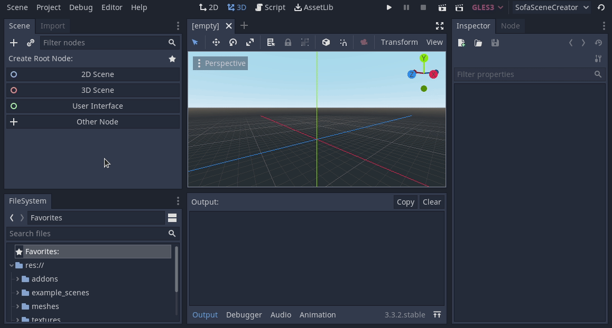

# Sofa Godot
Sofa Godot is a tool to create Sofa Scenes (XML for now) in Godot.


## Installation
This instruction is written for [Canonical Ubuntu 20.04](https://releases.ubuntu.com/20.04/) on x86-64.

Before creating the first scene, all required applications and packages need to be installed.

1. Install Godot
   * You can download the Godot game engine [here](https://godotengine.org/download/linux). This plugin was created using **Godot 3.3.2**.

1. Install Sofa
   * You can download the SOFA simulation framework [here](https://www.sofa-framework.org/download/). You can also build your own version if wanted or required.

1. Install required packages
   * ``` sudo apt install gmsh openctm-tools ```
      * gmsh is required to convert objects to tetrahedronal objects (for FEM)
      * openctm-tools contains a tool called *ctmconv* which is used to convert between *.obj* and *.stl* files (as needed by Godot and Gmsh respectively)
      
## Getting started
### Working with the plugin
* You can use this example project and create a new scene

OR

* You can copy the plugin folder (addons/sofa_scene_creator) into your Godot project and [enable](https://docs.godotengine.org/en/stable/tutorials/plugins/editor/installing_plugins.html) the plugin like any other Godot plugin.

### Using the example scenes
It is recommended to look at the example scenes (example_scenes/) before creating your own scenes. The **example scenes will not directly work** as the plugin does not
know where SOFA and the other applications are installed.



### Creating a new scene
You need to set the paths for each new scene you create in the root node.

* Note: To find the path to *gmsh* and *ctmconv* you can use the linux command ``` which gmsh ``` and ``` which ctmconv ```. The path to the SOFA binary will depend on how and where you installed it.

If you want to create a new scene, you have to create a SofaRoot object as the scene root, setup the paths:


### Running a scene
To finally run the scene, press F6 or the Play Scene button at the top right. A new instance of SOFA should automatically open if the binary path is set correctly.
All files that are needed to run the scene will automatically be generated and placed either in the project folder or the system temporary (/tmp/) folder.
